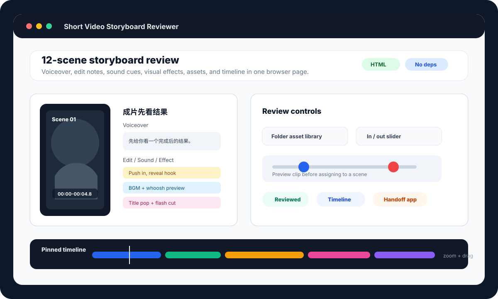

# Short Video Storyboard Reviewer

Local-first review tooling for short-form video storyboards. Write a structured Markdown table, generate an interactive browser review page, then package the page and media into a portable macOS handoff app.



## Why This Exists

Short video planning usually spreads across scripts, screenshots, sound notes, edit comments, and timeline references. This tool turns one Markdown storyboard into a single review surface where creators and editors can check the whole piece scene by scene.

It is designed for local work: no account, no upload, no cloud service, and no production media committed to Git.

## What You Get

| Output | Purpose |
| --- | --- |
| `storyboard_preview.html` | Interactive browser review page with scene cards, media previews, editable notes, review states, and a pinned timeline. |
| `review_report.md` | Timing, missing-field, text-density, and structure checks. |
| `assets_checklist.md` | Scene-by-scene asset list for editors. |
| `subtitles.srt` | Draft subtitle file generated from the voiceover column. |
| `timeline.json` | Structured timeline data for future automation. |

## Core Features

- Parse storyboard tables from Markdown.
- Review timing gaps, overlaps, total length, missing fields, and dense on-screen text.
- Auto-match numbered media from `storyboard/`, `frames/`, `assets/`, or `media/`.
- Use a browser folder picker for an external asset library.
- Preview videos and adjust in/out points with sliders.
- Edit voiceover, cut actions, sound/BGM notes, and visual effects in the page.
- Preview built-in sound/BGM cue names before adding them to a scene.
- Drag scene cards to reorder them during review.
- Use a pinned bottom timeline with zoom, pan, and playhead drag.
- Build a standalone macOS handoff package for another Mac.

## Quick Start

Generate review files from the included sample:

```bash
python3 video_md_tool.py examples/storyboard_sample.md --out examples/c451_tool_output
```

Open the generated page:

```bash
open examples/c451_tool_output/storyboard_preview.html
```

Run tests:

```bash
python3 -m unittest tests.test_video_md_tool tests.test_review_app_launcher -v
```

## Markdown Format

The input Markdown should contain a table with these columns:

```markdown
| 格 | 时间 | 原声口播 / 字幕 | 屏幕大字 | 画面内容 | 剪辑动作 | 音效 / BGM | 画面特效 / 转场 |
|---:|---|---|---|---|---|---|---|
| 1 | 00:00-00:04.8 | 先给你看结果。 | 成片先看结果 | 展示最终效果。 | 直接进入结果。 | BGM 第一拍进入。 | 标题字弹出。 |
```

See [examples/storyboard_sample.md](examples/storyboard_sample.md) for a complete 12-scene example.

## Asset Library

Put media next to your Markdown file:

```text
project/
  storyboard.md
  storyboard/
    01_hook.mp4
    02_scene.jpg
```

Then run:

```bash
python3 video_md_tool.py project/storyboard.md --asset-dir project
```

The generated HTML stores relative media paths where possible, so the page can travel with the project folder.

## macOS Review Server

For LAN review, generate a page first, then serve the project folder:

```bash
python3 video_md_tool.py examples/storyboard_sample.md --out examples/c451_tool_output
SHORT_VIDEO_REVIEW_PROJECT_DIR=examples scripts/serve_c451_review.sh
```

The launcher opens a local URL and copies a LAN URL such as:

```text
http://192.168.x.x:8765/c451_tool_output/storyboard_preview.html
```

## Standalone Handoff Package

After generating `c451_tool_output`, build a self-contained macOS package:

```bash
SHORT_VIDEO_HANDOFF_PROJECT_DIR=examples scripts/build_c451_handoff_package.sh
```

The script creates:

```text
短视频审片交接包/
短视频审片交接包.zip
```

The receiving Mac can unzip the package and open `短视频审片.app`. If macOS blocks the app, right-click it, choose **Open**, then confirm once more.

## CLI Reference

```bash
python3 video_md_tool.py INPUT.md [--out OUT_DIR] [--asset-dir DIR]
```

Optional clip helper:

```bash
python3 video_md_tool.py INPUT.md \
  --clip-scene 1 \
  --clip-source source.mp4 \
  --clip-start 2 \
  --clip-duration 3
```

The clip helper requires `ffmpeg`.

## Repository Hygiene

This repository intentionally ignores real media, generated review outputs, and handoff packages. Keep private videos, audio, course files, client work, and production archives out of Git.

Recommended public repo contents:

- source code
- tests
- docs
- small Markdown examples
- SVG/mock preview assets

Avoid committing:

- production `.mp4`, `.mov`, `.wav`, `.m4a`
- real client/course images
- generated `c451_tool_output/`
- local `.app` handoff bundles or `.zip` packages

## Project Status

This is a practical local tool, not a hosted editor. It currently focuses on Markdown-to-review-page workflows and macOS handoff packaging. Good next steps are a proper desktop shell, import/export presets, and cleaner project templates.

## License

MIT. See [LICENSE](LICENSE).
